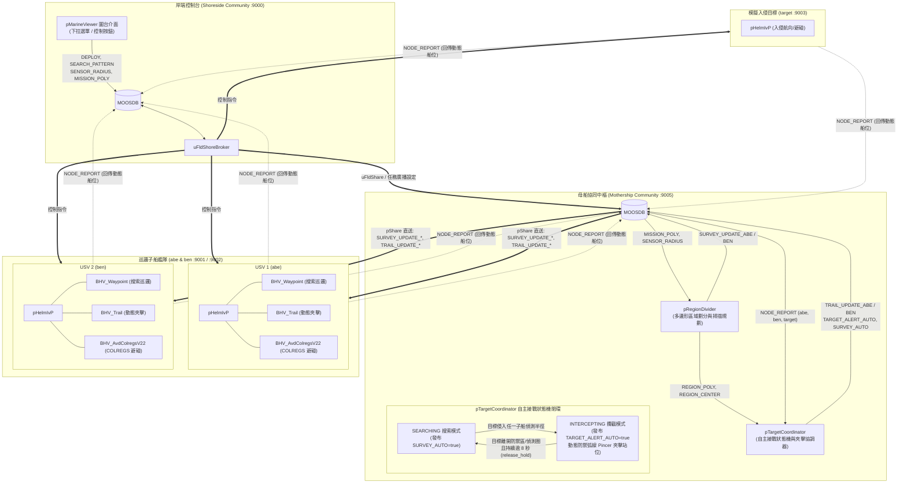

# 開發與修改紀錄報告 (2026-08-21)

---

## 一、 今日修改總覽與時間軸

本日主要聚焦於 **多無人船協同搜索與防禦攔截系統 (`m_shield_demo`)** 的關鍵演算法修復、狀態機閉環、幾何覆蓋優化、COLREGS 避碰規則調優以及圖形化介面（GUI）擴充。

### 🕒 修改檔案時間軸清單

| 時間 | 狀態 | 檔案路徑 | 模組 / 範疇 | 主要修改內容 |
| :--- | :---: | :--- | :--- | :--- |
| **09:36:54** | `M` | [`BHV_Trail.h`](file:///l:/home/yoei/moos-ivp/ivp/src/lib_behaviors-marine/BHV_Trail.h) [`BHV_Trail.cpp`](file:///l:/home/yoei/moos-ivp/ivp/src/lib_behaviors-marine/BHV_Trail.cpp) | 船艇航行行為 (IvP Behavior) | 新增 `eraseViewableTrailPoint()`，在行為結束/轉入 Idle 時自動清除圖台殘留航跡點。 |
| **09:39:23** | `M` | [`RegionDivider_Info.cpp`](file:///l:/home/yoei/moos-ivp/ivp/src/pRegionDivider/RegionDivider_Info.cpp) | 區域搜索劃分模組 | 更新 `pRegionDivider` 的參數說明文件與指令列介面資訊。 |
| **09:43:47** | `M` | [`PMV_GUI.cpp`](file:///l:/home/yoei/moos-ivp/ivp/src/pMarineViewer/PMV_GUI.cpp) | 視覺化介面 (pMarineViewer) | 實作 `menu_label` 階層式下拉選單支援，改善介面按鈕排版與分組。 |
| **09:44:05** | `M` | [`PMV_Info.cpp`](file:///l:/home/yoei/moos-ivp/ivp/src/pMarineViewer/PMV_Info.cpp) | 視覺化介面 (pMarineViewer) | 更新 `pMarineViewer` 的選單設定範例與參數說明。 |
| **10:36:43** | `M` | [`RegionDivider.h`](file:///l:/home/yoei/moos-ivp/ivp/src/pRegionDivider/RegionDivider.h) [`RegionDivider.cpp`](file:///l:/home/yoei/moos-ivp/ivp/src/pRegionDivider/RegionDivider.cpp) | 區域搜索劃分模組 | 重構多邊形全域覆蓋計算、動態間距縮放與 `REGION_POLY` 多邊形全域廣播。 |
| **10:56:57** | `??` (新) | [`dev_log_20260820.md`](file:///l:/home/yoei/moos-ivp/docs/dev_log_20260820.md) | 開發日誌 | 整理並記錄前一階段多船協同系統的開發歷程與驗收成果。 |
| **11:23:33** | `M` | [`meta_target.moos`](file:///l:/home/yoei/moos-ivp/ivp/missions/m_shield_demo/meta_target.moos) | 任務腳本 (入侵目標船) | 調整目標船的模擬通訊配置與 MOOS 橋接路由。 |
| **11:36:01** | `M` | [`BHV_AvdColregsV22.cpp`](file:///l:/home/yoei/moos-ivp/ivp/src/lib_behaviors-colregs/BHV_AvdColregsV22.cpp) | COLREGS 避碰行為 | 新增 `headon_abs_relbng_thresh` 參數，允許設定對遇（Rule 14）與交叉相遇的夾角閾值。 |
| **13:01:33** | `M` | [`README`](file:///l:/home/yoei/moos-ivp/ivp/missions/m_shield_demo/README) | 任務說明文件 | 撰寫 `m_shield_demo` 系統的完整架構指南、通訊變數表與操作手冊。 |
| **14:39:47** | `M` | [`TargetCoordinator.h`](file:///l:/home/yoei/moos-ivp/ivp/src/pTargetCoordinator/TargetCoordinator.h) | 協同目標協調器 | 定義自主接戰狀態機、偵測半徑環繪製、驅逐倒數與防護角度變數。 |
| **14:40:51** | `M` | [`TargetCoordinator.cpp`](file:///l:/home/yoei/moos-ivp/ivp/src/pTargetCoordinator/TargetCoordinator.cpp) | 協同目標協調器 | 核心演算法重構：全自主接戰/驅逐閉環、弧線防禦夾擊演算、船艏避碰安全扇區（Bow Guard）。 |
| **14:41:19** | `M` | [`meta_mothership.moos`](file:///l:/home/yoei/moos-ivp/ivp/missions/m_shield_demo/meta_mothership.moos) | 任務腳本 (母船/協調中心) | 配置 `pTargetCoordinator` 各項自動化參數（`auto_engage`, `release_hold`, `draw_detect_rings`）。 |
| **14:41:41** | `M` | [`meta_vehicle.bhv`](file:///l:/home/yoei/moos-ivp/ivp/missions/m_shield_demo/meta_vehicle.bhv) [`meta_vehicle.moos`](file:///l:/home/yoei/moos-ivp/ivp/missions/m_shield_demo/meta_vehicle.moos) | 任務腳本 (巡邏子船) | 綁定 `TARGET_ALERT_AUTO` 訊號，無縫對接搜索與動態站位夾擊行為。 |
| **14:42:06** | `M` | [`meta_target.bhv`](file:///l:/home/yoei/moos-ivp/ivp/missions/m_shield_demo/meta_target.bhv) | 任務腳本 (入侵目標船) | 優化入侵船的路徑循跡與自主避碰交互設定。 |
| **14:42:19** | `M` | [`meta_shoreside.moos`](file:///l:/home/yoei/moos-ivp/ivp/missions/m_shield_demo/meta_shoreside.moos) | 任務腳本 (岸端控制台) | 整合下拉選單、驅逐次數即時看板（`SHIELD_EVICTIONS`）與模式切換。 |
| **14:42:32** | `M` | [`TargetCoordinator_Info.cpp`](file:///l:/home/yoei/moos-ivp/ivp/src/pTargetCoordinator/TargetCoordinator_Info.cpp) | 協同目標協調器 | 更新 `pTargetCoordinator` 的 Synopsis、出版/訂閱介面與配置範例。 |

---

## 二、 今日重點解決問題詳細解析

本日研發重點針對多船協同演算法實測中暴露的 4 項核心瓶頸進行了徹底修復與升級：

### 1. 驅離後未正確切換回搜索 (Failure to resume search after eviction)
* **問題現象**：
  - 子船在完成目標逼退後，系統仍持續鎖定在攔截（`INTERCEPTING`）模式，無法自主重置警報，導致無人船滯留在防禦邊界外無法返回原搜索航線。
* **原因分析**：
  - 過去系統依賴操作員手動點擊按鈕或外部變數重置，缺乏「目標已脫離安全邊界」的持續時間判定與狀態機重置（Rearm）機制。
* **解決方案與程式修改**：
  - 在 [`TargetCoordinator.cpp`](file:///l:/home/yoei/moos-ivp/ivp/src/pTargetCoordinator/TargetCoordinator.cpp) 中實作**全自主接戰與驅逐狀態機**：
    1. 新增 `release_range`（脫離距離）與 `region_exit_buffer`（防禦區緩衝）。
    2. 新增 `release_hold`（脫離持續時間確認，預設 8 秒）：當目標離開防禦區且持續處於子船偵測半徑外達到設定秒數，才判定為成功驅離（`m_evictions++`）。
    3. 自動將 `TARGET_ALERT_AUTO` 設為 `false`，並發布 `SURVEY_AUTO=true`，使子船 Helm 平順切回搜索路徑。
    4. 加入 `reengage_delay`（冷卻期）防止邊界抖動重複觸發。

---

### 2. 部分搜索方式沒有完整遍歷搜索範圍 (Incomplete area traversal in certain patterns)
* **問題現象**：
  - 在非矩形的多邊形區域中，部分搜索模式（如向內螺旋 Inward Spiral 或特定角度的割草機 Lawnmower）在多邊形邊緣發生航點截斷，導致局部死角未被掃描。
* **原因分析**：
  - 舊幾何演算在做射線裁剪時，未考慮多邊形主軸方向與旋轉外接矩形（OBB）的映射關係，且子船間距縮放未與感測器半徑（`SENSOR_RADIUS`）完全聯鎖。
* **解決方案與程式修改**：
  - 重構 [`RegionDivider.cpp`](file:///l:/home/yoei/moos-ivp/ivp/src/pRegionDivider/RegionDivider.cpp)：
    1. 採用**主軸對齊（Principal Axis Alignment）**演算，依據多邊形特徵向量自動計算最佳掃描線角度。
    2. 依感測半徑動態計算掃描間距：`sweep_width = 2 * sensor_radius * overlap_factor`。
    3. 完善凸包頂點投影與路徑封閉檢查，確保掃描線完全覆蓋多邊形邊界。
    4. 新增 `REGION_POLY` 發布，讓母船協調器能取得最精確的防禦區多邊形邊界。

---

### 3. 沒有完全遵守避碰規則 (Non-compliance with COLREGS during close interception)
* **問題現象**：
  - 子船在近距離包夾或對向逼退目標船時，可能因夾角判定模糊而誤判相遇態勢（對遇 vs 交叉相遇），導致子船自身觸發不合理的急轉讓路，影響封堵效果。
* **原因分析**：
  - 原 `BHV_AvdColregsV22` 內部將 Rule 14（Head-on 對遇）的船艏判定夾角固定在 12 度，且在極近距離下無人船的防禦站位直接落入 COLREGS 激進避碰區（Rule 8d）。
* **解決方案與程式修改**：
  - 在 [`BHV_AvdColregsV22.cpp`](file:///l:/home/yoei/moos-ivp/ivp/src/lib_behaviors-colregs/BHV_AvdColregsV22.cpp) 中新增可配置參數 `headon_abs_relbng_thresh`，使對遇判定角度可配合演習場景靈活調節。
  - 在 [`TargetCoordinator.cpp`](file:///l:/home/yoei/moos-ivp/ivp/src/pTargetCoordinator/TargetCoordinator.cpp) 中加入安全下限保護：
    - `min_standoff`：限制尾隨/包夾距離底線，確保站位位於避碰激發半徑之外。
    - `bow_guard_deg`（船艏保護角）：當協調站位恰巧落在目標正前方盲區時，自動向兩側外推偏移，避免直接對頭阻擋引發碰撞風險。

---

### 4. 驅離方向和目標方向不一致 (Inconsistency between eviction geometry and target heading)
* **問題現象**：
  - 子船過去僅以目標自身航向（Target Heading）的左右兩側做固定角度尾隨，當目標正朝向防禦區內部高速侵入時，子船在後方跟隨無法形成有效「阻絕與向外驅趕」的屏障。
* **原因分析**：
  - 夾擊點未結合「被保護區域中心（`REGION_CENTER`）」與「目標位置」的方向向量，導致站位僅是「跟隨」而非「封堵」。
* **解決方案與程式修改**：
  - 在 [`TargetCoordinator.cpp`](file:///l:/home/yoei/moos-ivp/ivp/src/pTargetCoordinator/TargetCoordinator.cpp) 中實作**防禦弧線夾角封堵演算法（Pincer Blocking Arc）**：
    1. 計算由區域中心指向入侵目標的防禦向量（Defense Vector）。
    2. 在目標與受保護區之間構建一道垂直於入侵方向的防禦弧線，將兩艘子船分派於弧線兩翼（左翼/右翼站位）。
    3. 發布絕對方位角 `TRAIL_UPDATE_<VNAME>`，使子船始終卡在目標與防禦區核心之間，利用目標船自身的避碰機制迫使其掉頭轉向外海。

---

## 三、 系統架構變更與流程圖

---

## 四、 待處理事項 (To-Do Items)

- [ ] **1. 新增可在 `pMarineViewer` 微調避碰標準的下拉選單**：
  - 利用今日在 [`PMV_GUI.cpp`](file:///l:/home/yoei/moos-ivp/ivp/src/pMarineViewer/PMV_GUI.cpp) 擴充之 `menu_label` 功能，於岸端設定檔 [`meta_shoreside.moos`](file:///l:/home/yoei/moos-ivp/ivp/missions/m_shield_demo/meta_shoreside.moos) 中建立 `Action/COLREGS` 階層式選單。
  - 提供快速切換避碰靈敏度與規則參數（如：`COLREGS_MODE=Aggressive / Standard / Safe` 或調整 `headon_abs_relbng_thresh`），讓操作員能在圖台即時微調各船避碰標準。
