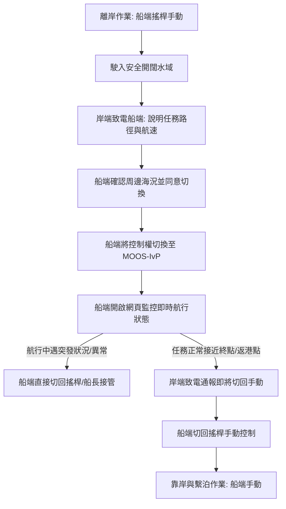

# 無人船（USV）搖桿與 MOOS-IvP 控制切換安全作業須知 (SOP)

> **版本**：v1.1  
> **最後更新日期**：2026-08-20  
> **適用對象**：船端操作員、隨船船長/船員、岸端 MOOS-IvP 控制員  

---

## 1. 目的與核心原則

本作業須知旨在規範無人船（USV）在**船端手動搖桿操控**與**岸端 MOOS-IvP 自主控制**之間的切換流程，以降低人機協同風險，確保人員、船體與海上周邊設施安全。

### 核心安全原則
* **安全第一**：任何情況下，人命與船隻安全高於自主任務完成度。
* **船端優先（Manual Override）**：船端操作員/船長隨時擁有最高控制優先權，可隨時無條件接管。
* **雙向確認**：控制權切換前必須完成「口頭通報」、「路徑簡述」與「雙向覆誦確認」。

---

## 2. 角色分工與權限優先級

### 2.1 角色職責

| 角色 | 所在位置 | 主要職責 | 操控介面 / 工具 |
| :--- | :--- | :--- | :--- |
| **船端操作員 / 船長** | 船上 | 負責離靠岸、近場避障、應急接管、船端網頁監控 | 手動搖桿 / 實體控制台、監控網頁 |
| **岸端控制員** | 岸端控制站 (GCS) | 負責任務規劃、路徑下發、MOOS-IvP 狀態監控 | MOOS-IvP / pMarineViewer 控制台、電話/通訊設備 |

### 2.2 控制權限優先級架構

```
[最高優先] 1. 船長 / 船端緊急手動控制 (實體舵輪 / 急停 / 覆寫開關)
                 ▲
                 │
[次高優先] 2. 船端搖桿手動模式 (船上操作員手動遙控)
                 ▲
                 │
[第三優先] 3. 岸端 MOOS-IvP 自主控制模式 (岸端演算法自主導航)
```

---

## 3. 控制模式切換標準作業程序 (SOP)



---

### 3.1 階段一：離岸出港階段（船端搖桿主導）
1. **離岸操作**：船隻離泊、解纜、出港及低速穿過擁擠水域，**一律由船上操作員以手動搖桿操控**。
2. **就緒條件**：船隻完全駛離港區碼頭、進入視野良好且無近距離障礙之開闊水域後，方可進入控制權交接準備。

---

### 3.2 階段二：切換至 MOOS-IvP 自主控制（通報與交接）
當岸端 MOOS-IvP 操作者準備接手時，必須嚴格執行下列步驟：

1. **岸端電話通報與路徑告知**：
   - 岸端操作者透過電話聯繫船上操作員。
   - **岸端通報內容規範**：
     - 目前準備執行的 MOOS Behavior（例如：`Waypoint` 巡航、航線跟隨）。
     - **船隻接下來的預期路徑走向**（例如：「預計朝方位角 085、航速 4 節、先向東直行 600 公尺後左轉向北」）。
     - 預計自動控制持續時間及重要轉向點。
2. **船端環境確認**：
   - 船上人員環顧海面，確認周遭無浮標、漁網、小型作業船隻或漂流物。
   - 確認理解即將進行的路徑走向後，口頭覆誦並回覆：「了解，周圍清空，準備切換 MOOS-IvP」。
3. **執行模式切換**：
   - 船端操作員將控制開關或軟體權限切換至 `MOOS-IvP / Auto`。
   - 岸端確認收到船隻即時回傳的航行數據（如GPS位置、航向、航速等參數）且數值更新正常，正式開始自主航行。

---

### 3.3 階段三：自主航行與船端即時監控
1. **船端網頁即時監控**：
   - 船上人員開啟專用**網頁版監控視窗**，即時檢視船隻執行狀態。
   - **核心監控項目**：
     - **航向與航速 (Heading & Speed)**：是否與岸端告知之走向一致。
     - **目標航點與軌跡 (Next Waypoint & Track)**：確認目前跟隨之航線。
     - **連線品質與心跳訊號 (Heartbeat / Link Quality)**：確保通訊正常。
     - **MOOS 任務模式狀態 (Mission Mode / Active Behaviors)**。
2. **持續保持瞭望**：
   - 船端人員雖處於自動模式，仍需保持基本瞭望，確保實際水面狀況與網頁資訊吻合。

---

### 3.4 階段四：自動任務結束與靠岸作業（交接回手動）
1. **交接預告**：船隻抵達預定終點或距離港口進口約 50-100 公尺時，岸端適時提前致電通知船端準備接管。
2. **切回搖桿**：船端操作員將控制權切回搖桿手動模式，並口頭回覆「船端已切回手動」。
3. **靠港操作**：進港、減速、轉向、靠泊與繫纜均由船端手動搖桿全程操作。

---

## 4. 緊急應變與手動接管機制（Manual Override）

遇到以下任何一種情況時，**船端人員無須等待岸端同意，應立即切換為手動搖桿或船長操控**：

### 4.1 立即接管條件
* **近距離避碰危機**：視線範圍內突發他船逼近、未標示之定置漁網或浮木。
* **航行軌跡嚴重異常**：船隻出現非預期之劇烈轉向、原地打轉或速度失控。
* **通訊中斷且行為不確定**：網頁數據凍結、通訊異常且船隻動態無法預測。
* **海況驟變**：突發湧浪或強風流需人工頂風頂浪航行。

### 4.2 緊急接管程序
1. **立即切換**：撥動實體搖桿或切換安全開關，強制覆寫控制權（Override）。
2. **控制船態**：手動減速、停俥或轉向至安全水域。
3. **通報岸端**：致電岸端：「船端已緊急接管手動，原因為［說明原因］，請岸端暫停 MOOS-IvP 任務」。

---

## 5. 操作檢核清單 (Checklist)

### ✅ 出港切換至 MOOS-IvP 檢核
- [ ] 船隻已出港並航行至安全開闊水域。
- [ ] 岸端已來電告知預計航向、航速與整體走向。
- [ ] 船端已確認航向前方與周遭 50-100 公尺內無障礙物/危險船隻。
- [ ] 船端網頁監控視窗已正常連線且數據更新正常。
- [ ] 完成控制權切換，雙方確認「MOOS-IvP 已接管」。

### ✅ 自主航行中監控檢核
- [ ] 船隻實際航向與網頁顯示航線吻合。
- [ ] 網頁通訊連線狀態綠燈（Heartbeat 正常）。
- [ ] 手動搖桿位於隨手可及處，無任何遮擋。

### ✅ 靠港切回手動檢核
- [ ] 岸端來電告知即將抵達交接點。
- [ ] 船端切換回搖桿模式並確認舵機/推進器響應正常。
- [ ] 船端回報「手動已接管」，開始進行靠港作業。
